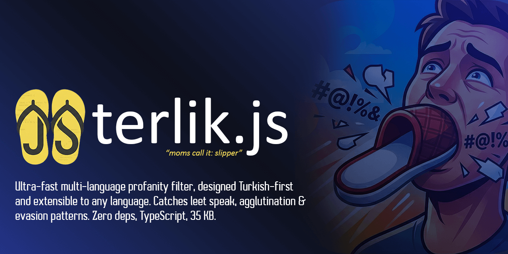

# terlik.js



[](https://github.com/badursun/terlik.js/actions/workflows/ci.yml)
[](https://www.npmjs.com/package/terlik.js)
[](https://www.npmjs.com/package/terlik.js)
[](https://bundlephobia.com/package/terlik.js)
[](https://www.typescriptlang.org/)
[]()
[](https://opensource.org/licenses/MIT)

Multi-language profanity detection and filtering engine, designed Turkish-first and **extensible to any language**. Not a naive blacklist — a multi-layered normalization and pattern engine that catches what simple string matching misses.

Ships with **Turkish** (flagship, full coverage), **English**, **Spanish**, and **German** built-in. Add any language with a folder and two files, or extend at runtime via `extendDictionary`.

> **Turkce:** Turkce oncelikli, her dile genisletilebilir kufur tespit ve filtreleme motoru. Leet speak, karakter tekrari, ayirici karakterler ve Turkce ek sistemi destegi ile yaratici kufur denemelerini yakalar. Sifir bagimlilik, TypeScript, ~14 KB gzip (tek dil: ~10 KB).

## Features

- **Extensible to any language** — ships with TR/EN/ES/DE, add more via language packs or `extendDictionary`
- Catches leet speak, separators, char repetition, mixed case, zero-width chars
- Turkish suffix engine (83 suffixes, ~10,000+ detectable forms from 147 roots)
- Three detection modes: strict, balanced, loose (with fuzzy matching)
- Zero dependencies, **~14 KB** gzip (single language: **~10 KB** with per-language imports)
- Per-language sub-path imports for minimal bundle size (`terlik.js/tr`, `/en`, `/es`, `/de`)
- ESM + CJS — works in Node.js, Bun, Deno, browsers, Cloudflare Workers, Edge runtimes
- Lazy compilation: ~1.5ms construction, <1ms per check after warmup
- ReDoS-safe regex patterns with timeout safety net
- Full TypeScript support with exported types

## Why terlik.js?

Turkish profanity evasion is creative. Users write `s2k`, `$1kt1r`, `s.i.k.t.i.r`, `SİKTİR`, `siiiiiktir`, `i8ne`, `or*spu`, `pu$ttt`, `6öt` — and expect to get away with it. Turkish is agglutinative — a single root like `sik` spawns dozens of forms: `siktiler`, `sikerim`, `siktirler`, `sikimsonik`. Manually listing every variant doesn't scale.

terlik.js catches all of these with a **suffix engine** that automatically recognizes Turkish grammatical suffixes on profane roots. Here's what a single call handles:

```ts
import { Terlik } from "terlik.js";
const terlik = new Terlik();

terlik.clean("s2mle yüzle$ g0t_v3r3n o r o s p u pezev3nk i8ne pu$ttt or*spu");
// "***** yüzle$ ********* *********** ******** **** ****** ******"
// 7 matches, 0 false positives, <2ms
```

## Install

```bash
npm install terlik.js
# or
pnpm add terlik.js
# or
yarn add terlik.js
```

## Quick Start

```ts
import { Terlik } from "terlik.js";

// Turkish (default)
const tr = new Terlik();
tr.containsProfanity("siktir git");  // true
tr.clean("siktir git burdan");       // "****** git burdan"

// English
const en = new Terlik({ language: "en" });
en.containsProfanity("what the fuck"); // true
en.containsProfanity("siktir git");    // false (Turkish not loaded)

// Spanish & German
const es = new Terlik({ language: "es" });
const de = new Terlik({ language: "de" });
es.containsProfanity("hijo de puta");  // true
de.containsProfanity("scheiße");       // true
```

## Per-Language Imports

If you only need **one language**, use sub-path imports to cut your bundle size by ~30%:

```ts
// Only Turkish — no EN/ES/DE dictionaries bundled
import { Terlik } from "terlik.js/tr";
const t = new Terlik();
t.containsProfanity("siktir"); // true

// Or use the factory
import { createTerlik } from "terlik.js/en";
const en = createTerlik({ mode: "strict" });
```

| Import | Gzip size | Includes |
|---|---|---|
| `terlik.js` | ~14 KB | All 4 languages (TR, EN, ES, DE) |
| `terlik.js/tr` | ~10 KB | Turkish only |
| `terlik.js/en` | ~10 KB | English only |
| `terlik.js/es` | ~9 KB | Spanish only |
| `terlik.js/de` | ~9 KB | German only |

Each sub-path exports `Terlik`, `createTerlik`, `TerlikCore`, `languageConfig`, and all types. See [API Reference](./docs/api.md#per-language-imports) for advanced usage with `TerlikCore`.

## What It Catches

| Evasion technique | Example | Detected as |
|---|---|---|
| Plain text | `siktir` | sik |
| Turkish İ/I | `SİKTİR` | sik |
| Leet speak | `$1kt1r`, `@pt@l` | sik, aptal |
| Visual leet (TR) | `8ok`, `6öt`, `i8ne`, `s2k` | bok, göt, ibne, sik |
| Turkish number words | `s2mle` (s+iki+mle) | sik (sikimle) |
| Separators | `s.i.k.t.i.r`, `s_i_k` | sik |
| Spaces | `o r o s p u` | orospu |
| Char repetition | `siiiiiktir`, `pu$ttt` | sik, puşt |
| Mixed punctuation | `or*spu`, `g0t_v3r3n` | orospu, göt |
| Combined | `$1kt1r g0t_v3r3n` | both caught |
| **Suffix forms** | `siktiler`, `orospuluk`, `gotune` | sik, orospu, göt |
| **Suffix + evasion** | `s.i.k.t.i.r.l.e.r`, `$1kt1rler` | sik |
| **Suffix chaining** | `siktirler` (sik+tir+ler) | sik |
| **Deep agglutination** | `siktiğimin`, `sikermisiniz`, `siktirmişcesine` | sik |
| **Zero-width chars** | `s\u200Bi\u200Bk\u200Bt\u200Bi\u200Br` (ZWSP/ZWNJ/ZWJ) | sik |
| **Phonetic (EN)** | `phuck`, `phucking` | fuck |
| **Extended leet (EN)** | `8itch`, `s#it`, `ni66er` | bitch, shit, nigger |

### What It Doesn't Catch (on purpose)

Whitelist prevents false positives on legitimate words:

```ts
terlik.containsProfanity("Amsterdam");    // false
terlik.containsProfanity("sikke");        // false (Ottoman coin)
terlik.containsProfanity("ambulans");     // false
terlik.containsProfanity("siklet");       // false (boxing weight class)
terlik.containsProfanity("memur");        // false
terlik.containsProfanity("malzeme");      // false
terlik.containsProfanity("ama");          // false (conjunction)
terlik.containsProfanity("amir");         // false
terlik.containsProfanity("dolmen");       // false
```

## How It Works

Ten-stage normalization pipeline (language-aware), then pattern matching:

```
input
  → strip invisible chars (ZWSP, ZWNJ, soft hyphen, etc.)
  → NFKD decompose (fullwidth → ASCII, precomposed → base + combining)
  → strip combining marks (diacritics)
  → lowercase (locale-aware: "tr", "en", "es", "de")
  → Cyrillic confusable → Latin (а→a, с→c, е→e, ...)
  → char folding (language-specific: İ→i, ñ→n, ß→ss, ä→a, ...)
  → number expansion (optional, e.g. Turkish: s2k → sikik)
  → leet speak decode (0→o, 1→i, @→a, $→s, ...)
  → punctuation removal (between letters: s.i.k → sik)
  → repeat collapse (siiiiik → sik)
  → pattern matching (dynamic regex with language-specific char classes)
  → whitelist filtering
  → result
```

Each language has its own char map, leet map, char classes, and optional number expansions. The engine is language-agnostic — only the data is language-specific. This means **any language can be added** without modifying the core engine.

For suffixable roots, the engine appends an optional suffix group (up to 2 chained suffixes). Turkish has 83 suffixes (including question particles and adverbial forms), English has 28 (inflectional, derivational, and compound elements), Spanish has 13, German has 8.

### Language Packs

Community contributions to existing language packs (new words, variants, whitelist entries) and entirely new language packs are welcome! See [CONTRIBUTING.md](./CONTRIBUTING.md) for step-by-step instructions.

Each language lives in its own folder under `src/lang/`:

```
src/lang/
  tr/
    config.ts           ← charMap, leetMap, charClasses, locale
    dictionary.json     ← entries, suffixes, whitelist
  en/
    config.ts
    dictionary.json
  ...
```

Dictionary format (community-friendly JSON, no TypeScript needed):

```json
{
  "version": 1,
  "suffixes": ["ing", "ed", "er", "s"],
  "entries": [
    { "root": "fuck", "variants": ["fucking", "fucker"], "severity": "high", "category": "sexual", "suffixable": true }
  ],
  "whitelist": ["assassin", "class", "grass"]
}
```

Categories: `sexual`, `insult`, `slur`, `general`. Severity: `high`, `medium`, `low`.

### Adding a New Language

1. Create `src/lang/xx/` folder
2. Add `dictionary.json` (entries, suffixes, whitelist)
3. Add `config.ts` (locale, charMap, leetMap, charClasses)
4. Register in `src/lang/index.ts` (one import line)
5. Write tests, build, done

## Dictionary Strategy

terlik.js ships with a **deliberately narrow dictionary** — the goal is to **minimize false positives** while catching real-world evasion patterns. The dictionary is not a massive word list; it's a curated set of roots + variants that the pattern engine expands through normalization, leet decoding, separator tolerance, and suffix chaining.

### Coverage

| Language | Status | Roots | Explicit Variants | Suffixes | Whitelist | Effective Forms |
|---|---|---|---|---|---|---|
| Turkish | Flagship | 147 | 139 | 83 | 87 | ~10,000+ |
| English | Full | 138 | 342 | 28 | 106 | ~10,000+ |
| Spanish | Community | 29 | 101 | 13 | 21 | ~500+ |
| German | Community | 28 | 67 | 8 | 6 | ~300+ |

"Effective forms" = roots × normalization variants × suffix combinations × evasion patterns. A root like `sik` with 83 possible suffixes, leet decoding, separator tolerance, and repeat collapse produces thousands of detectable surface forms.

> **Add your language!** The engine is language-agnostic. See [Adding a New Language](#adding-a-new-language) or use [`extendDictionary`](#extenddictionary-option) for runtime extension.

### What IS Covered

- **Core profanity roots** per language (high-severity sexual, insults, slurs)
- **Grammatical inflections** via suffix engine (Turkish agglutination, English -ing/-ed, etc.)
- **Evasion patterns**: leet speak, separators, repetition, mixed case, number words (TR)
- **Compound forms**: `orospucocugu`, `motherfucker`, `hijoputa`, `hurensohn`

### What is NOT Covered (by design)

- **Slang / regional variants** that change rapidly — better handled with `customList`
- **Context-dependent words** that are profane only in certain contexts
- **New coinages** — use `addWords()` at runtime

### Why Narrow?

A large dictionary maximizes recall but tanks precision. In production chat systems, **false positives are worse than false negatives** — blocking "class" or "grass" because the dictionary is too broad erodes user trust. terlik.js defaults to high precision and lets you widen coverage per your needs:

> **The `sık`/`sik` paradox:** Turkish `sık` (frequent/tight) normalizes to `sik` because `ı→i` char folding is required to catch evasions like `s1kt1r`. Making `sik` suffix-aware would flag `sıkıntı` (trouble), `sıkma` (squeeze), `sıkı` (tight) — extremely common words. Instead, deep agglutination forms like `siktiğimin` and `sikermisiniz` are added as explicit variants. This is a deliberate precision-over-recall tradeoff.

```ts
// Add domain-specific words
terlik.addWords(["customSlang", "anotherWord"]);

// Or at construction time
const terlik = new Terlik({
  customList: ["customSlang", "anotherWord"],
  whitelist: ["legitimateWord"],
});

// Remove a built-in word if it causes false positives in your domain
terlik.removeWords(["damn"]);
```

## Performance

### Lazy Compilation

terlik.js uses **lazy compilation** — `new Terlik()` is near-instant (~1.5ms). Regex patterns are compiled on the first `detect()` call, not at construction time. This eliminates startup cost when creating multiple instances.

| Phase | Cost | When |
|---|---|---|
| `new Terlik()` | **~1.5ms** | Construction (lookup tables only) |
| First `detect()` | ~200-700ms | Lazy regex compilation + V8 JIT warmup |
| Subsequent calls | **<1ms** | Patterns cached, JIT optimized |

**Where do you want to pay the compilation cost?**

```ts
// Option A: Background warmup (recommended for servers)
// Construction is instant. Patterns compile in the next event loop tick.
// If a request arrives before warmup finishes, it compiles synchronously.
const terlik = new Terlik({ backgroundWarmup: true });

app.post("/chat", (req, res) => {
  const cleaned = terlik.clean(req.body.message); // <1ms (warmup already done)
});
```

```ts
// Option B: Explicit warmup at startup
const terlik = new Terlik();
terlik.containsProfanity("warmup"); // Forces compilation here

app.post("/chat", (req, res) => {
  const cleaned = terlik.clean(req.body.message); // <1ms
});
```

```ts
// Option C: Lazy (pay on first request)
const terlik = new Terlik(); // ~1.5ms

app.post("/chat", (req, res) => {
  const cleaned = terlik.clean(req.body.message); // First call: ~500ms, then <1ms
});
```

```ts
// Option D: Multi-language warmup
const cache = Terlik.warmup(["tr", "en", "es", "de"]);

app.post("/chat", (req, res) => {
  const lang = req.body.language;
  const cleaned = cache.get(lang)!.clean(req.body.message); // <1ms
});
```

> **Important:** Never create `new Terlik()` per request. A single cached instance handles requests in microseconds.

> **Serverless (Lambda, Vercel, Cloudflare Workers):** Do NOT use `backgroundWarmup`. The `setTimeout` callback may never fire because serverless runtimes freeze the process between invocations. Use explicit warmup instead: `const t = new Terlik(); t.containsProfanity("warmup");` at module scope.

### Throughput

Benchmark results (Apple Silicon, single core, msgs/sec):

| Scenario | msgs/sec |
|---|---|
| Clean messages (no matches) | ~193,000 |
| Mixed messages (balanced mode) | ~151,000 |
| Suffixed dirty messages | ~142,000 |
| Strict mode | ~390,000 |
| Loose mode (with fuzzy) | ~8,400 |

> **Note:** Loose/fuzzy mode is ~18x slower than balanced mode due to O(n*m) similarity computation. Use it only when typo tolerance is critical, not as a default.

### vs Alternatives (English corpus)

Head-to-head comparison on a **1280-sample English corpus** (290 curated + 990 SPDG-generated adversarial samples) covering plain text, variants, leet speak, separator evasion, char repetition, combined evasion, false-positive traps, edge cases, and synthetic adversarial patterns (zalgo, zero-width chars, unicode homoglyphs, reverse, vowel drop). All libraries tested with default settings.

| Library | F1 | Precision | Recall | FPR | check() ops/sec | clean() ops/sec |
|---|---|---|---|---|---|---|
| **terlik.js** | **78.5%** | **100.0%** | **64.7%** | **0.0%** | 38K | 37K |
| obscenity | 44.0% | 86.0% | 29.6% | 5.2% | **73K** | **52K** |
| bad-words | 33.0% | 100.0% | 19.8% | 0.0% | 3K | 614 |
| allprofanity | 29.4% | 95.0% | 17.4% | 1.0% | 47K | 47K |

On the **curated 290-sample subset**, terlik.js achieves **100% F1** — perfect precision, perfect recall, zero false positives. The overall F1 of 78.5% reflects intentionally adversarial SPDG samples (zalgo text, zero-width chars, unicode homoglyphs) that stress-test detection boundaries. terlik.js **still leads by 34+ F1 points** over every competitor. See [full methodology, per-category breakdown, and limitations](./docs/benchmark-comparison.md).

> **Throughput note:** The multi-pass detection pipeline (NFKD, Cyrillic confusable mapping, CamelCase decompounding) costs ~17% vs a naive single-pass approach — this is what enables the highest recall among all tested libraries. Optional toggles (`disableLeetDecode`, `disableCompound`) can recover ~5-8% for controlled inputs. Safety layers (NFKD, diacritics, Cyrillic) are always active. See [full toggle guide](./docs/benchmark-comparison.md#where-does-the-throughput-go).
>
> **Transparency:** This benchmark is maintained by the terlik.js team. Dataset, adapters, and runner are open source. Reproduce with `pnpm bench:compare`. We document every false positive and miss — [see the full report](./docs/benchmark-comparison.md).

### Accuracy

Measured on a labeled corpus of 388 samples across 4 languages (profane + clean + whitelist + edge cases):

| Language | Mode | Precision | Recall | F1 | FPR | FNR |
|---|---|---|---|---|---|---|
| TR | strict | 100.0% | 88.6% | 93.9% | 0.0% | 11.4% |
| TR | **balanced** | **100.0%** | **100.0%** | **100.0%** | **0.0%** | **0.0%** |
| TR | loose | 99.1% | 100.0% | 99.5% | 1.6% | 0.0% |
| EN | strict | 100.0% | 95.5% | 97.7% | 0.0% | 4.5% |
| EN | **balanced** | **100.0%** | **100.0%** | **100.0%** | **0.0%** | **0.0%** |
| EN | loose | 98.5% | 100.0% | 99.2% | 2.0% | 0.0% |
| ES | strict | 100.0% | 96.7% | 98.3% | 0.0% | 3.3% |
| ES | **balanced** | **100.0%** | **96.7%** | **98.3%** | **0.0%** | **3.3%** |
| ES | loose | 100.0% | 96.7% | 98.3% | 0.0% | 3.3% |
| DE | strict | 100.0% | 100.0% | 100.0% | 0.0% | 0.0% |
| DE | **balanced** | **100.0%** | **100.0%** | **100.0%** | **0.0%** | **0.0%** |
| DE | loose | 100.0% | 100.0% | 100.0% | 0.0% | 0.0% |

**Mode characteristics:**
- **Strict** — highest precision (0% FP), trades recall for safety. Misses some suffixed forms and evasion patterns.
- **Balanced** — best overall F1. Catches evasion patterns while keeping FPR near zero. **Recommended for production.**
- **Loose** — adds fuzzy matching. Slightly higher FPR due to similarity matches on borderline words.

Reproduce: `pnpm bench:accuracy` — outputs per-category breakdown, failure list, and JSON results.

## Options

```ts
const terlik = new Terlik({
  language: "tr",                // built-in: "tr" | "en" | "es" | "de" (default: "tr")
  mode: "balanced",              // "strict" | "balanced" | "loose"
  maskStyle: "stars",            // "stars" | "partial" | "replace"
  replaceMask: "[***]",          // mask text for "replace" style
  customList: ["customword"],    // additional words to detect
  whitelist: ["safeword"],       // additional words to whitelist
  enableFuzzy: false,            // enable fuzzy matching
  fuzzyThreshold: 0.8,           // similarity threshold (0-1). 0.8 ≈ 1 typo per 5 chars
  fuzzyAlgorithm: "levenshtein", // "levenshtein" | "dice"
  maxLength: 10000,              // truncate input beyond this
  backgroundWarmup: false,       // compile patterns in background via setTimeout
  extendDictionary: undefined,   // DictionaryData object to merge with built-in dictionary
  disableLeetDecode: false,      // skip leet-speak decoding (safety layers remain active)
  disableCompound: false,        // skip CamelCase decompounding pass
  minSeverity: undefined,        // "high" | "medium" | "low" — exclude below threshold
  excludeCategories: undefined,  // ["slur"] — exclude specific categories
});
// For per-language import options, see docs/api.md
```

## Detection Modes

| Mode | What it does | Best for |
|---|---|---|
| `strict` | Normalize + exact match only | Minimum false positives |
| `balanced` | Normalize + pattern matching with separator/leet tolerance | **General use (default)** |
| `loose` | Pattern + fuzzy matching (Levenshtein or Dice) | Maximum coverage, typo tolerance |

## API

### `terlik.containsProfanity(text, options?): boolean`

Quick boolean check. Runs full detection internally and returns `true` if any match exists.

### `terlik.getMatches(text, options?): MatchResult[]`

Returns all matches with details:

```ts
interface MatchResult {
  word: string;       // matched text from original input
  root: string;       // dictionary root word
  index: number;      // position in original text
  severity: "high" | "medium" | "low";
  category?: "sexual" | "insult" | "slur" | "general"; // undefined for custom words
  method: "exact" | "pattern" | "fuzzy";
}
```

### `terlik.clean(text, options?): string`

Returns text with profanity masked. Three styles:

```ts
terlik.clean("siktir git");                                    // "****** git"
terlik.clean("siktir git", { maskStyle: "partial" });          // "s****r git"
terlik.clean("siktir git", { maskStyle: "replace" });          // "[***] git"
```

### `terlik.addWords(words) / removeWords(words)`

Runtime dictionary modification. Recompiles patterns automatically.

```ts
terlik.addWords(["customword"]);
terlik.containsProfanity("customword"); // true

terlik.removeWords(["salak"]);
terlik.containsProfanity("salak"); // false
```

### `Terlik.warmup(languages, options?): Map<string, Terlik>`

Static method. Creates and JIT-warms instances for multiple languages at once.

```ts
const cache = Terlik.warmup(["tr", "en", "es", "de"]);
cache.get("en")!.containsProfanity("fuck"); // true — no cold start
```

### `extendDictionary` Option

Merge an external dictionary with the built-in one. Useful for teams managing custom word lists without modifying the core package:

```ts
const terlik = new Terlik({
  extendDictionary: {
    version: 1,
    suffixes: ["ci", "cu"],
    entries: [
      { root: "customword", variants: ["cust0mword"], severity: "high", category: "general", suffixable: true },
    ],
    whitelist: ["safeterm"],
  },
});

terlik.containsProfanity("customword");    // true
terlik.containsProfanity("customwordci");  // true (suffix match)
terlik.containsProfanity("safeterm");      // false (whitelisted)
terlik.containsProfanity("siktir");        // true (built-in still works)
```

The extension dictionary must follow the same schema as built-in dictionaries. Duplicate roots are skipped; suffixes and whitelist entries are merged. Pattern cache is disabled for extended instances.

### `terlik.language: string`

Read-only property. Returns the language code of the instance.

### `getSupportedLanguages(): string[]`

Returns all available language codes.

```ts
import { getSupportedLanguages } from "terlik.js";
getSupportedLanguages(); // ["tr", "en", "es", "de"]
```

### `normalize(text): string`

Standalone export. Uses Turkish locale by default.

```ts
import { normalize, createNormalizer } from "terlik.js";

normalize("S.İ.K.T.İ.R"); // "siktir" (Turkish default)

// Custom normalizer for any language
const deNormalize = createNormalizer({
  locale: "de",
  charMap: { ä: "a", ö: "o", ü: "u", ß: "ss" },
  leetMap: { "0": "o", "3": "e" },
});
deNormalize("Scheiße"); // "scheisse"
```

### `TerlikCore`

Low-level class that accepts a pre-resolved `LanguageConfig` instead of a language string. Used internally by per-language entry points. Useful for custom language configs or advanced tree-shaking scenarios.

> See [Full API Reference](./docs/api.md) for complete documentation including all types, per-call options, and `TerlikCore`.

## Testing

1341 tests covering all built-in languages, 147 Turkish root words, 138 English roots, suffix detection, lazy compilation, multi-language isolation, normalization, fuzzy matching, cleaning, integration, ReDoS hardening, attack surface coverage, external dictionary merging, per-language entry points, and edge cases:

```bash
pnpm test          # run once
pnpm test:watch    # watch mode
```

### Synthetic Dataset Testing (SPDG)

The [Synthetic Profanity Dataset Generator](./tools/Synthetic-Profanity-Dataset-Generator/README.md) produces hundreds of randomized evasion patterns (leet speak, zalgo, separators, zero-width chars, unicode homoglyphs, etc.) and tests them against the detection engine with statistical thresholds per difficulty level:

```bash
pnpm spdg          # generate datasets + run tests (single command)
pnpm spdg:generate # generate 4-language JSONL datasets only
pnpm test:spdg     # run SPDG tests only (datasets must exist)
```

SPDG tests are automatically skipped when dataset files are absent — zero impact on the regular test suite. See [SPDG Automated Test docs](./docs/spdg-automated-test.md) for thresholds, pipeline details, and reference results.

### Live Test Server

An interactive browser-based test environment is included. Chat interface on the left, real-time process log on the right — see exactly what terlik.js does at each step (normalization, pattern matching, match details, timing).

```bash
pnpm dev:live      # http://localhost:2026
```

See [`tools/README.md`](./tools/README.md) for details.

### Integration Guide

See [**Integration Guide**](./docs/integration-guide.md) for Express, Fastify, Next.js, Nuxt, Socket.io, and multi-language server examples.

## Development

```bash
pnpm install          # install dependencies
pnpm test             # run tests
pnpm test:coverage    # run tests with coverage report
pnpm typecheck        # TypeScript type checking
pnpm build            # build ESM + CJS output
pnpm bench            # run performance benchmarks
pnpm bench:compare    # run comparison benchmark vs alternatives
pnpm dev:live         # start interactive test server
```

Pre-commit hooks (via Husky) automatically run type checking on staged `.ts` files.

See [CONTRIBUTING.md](./CONTRIBUTING.md) for contribution guidelines.

## Changelog

See [CHANGELOG.md](./CHANGELOG.md) for the full version history.

## License

MIT
